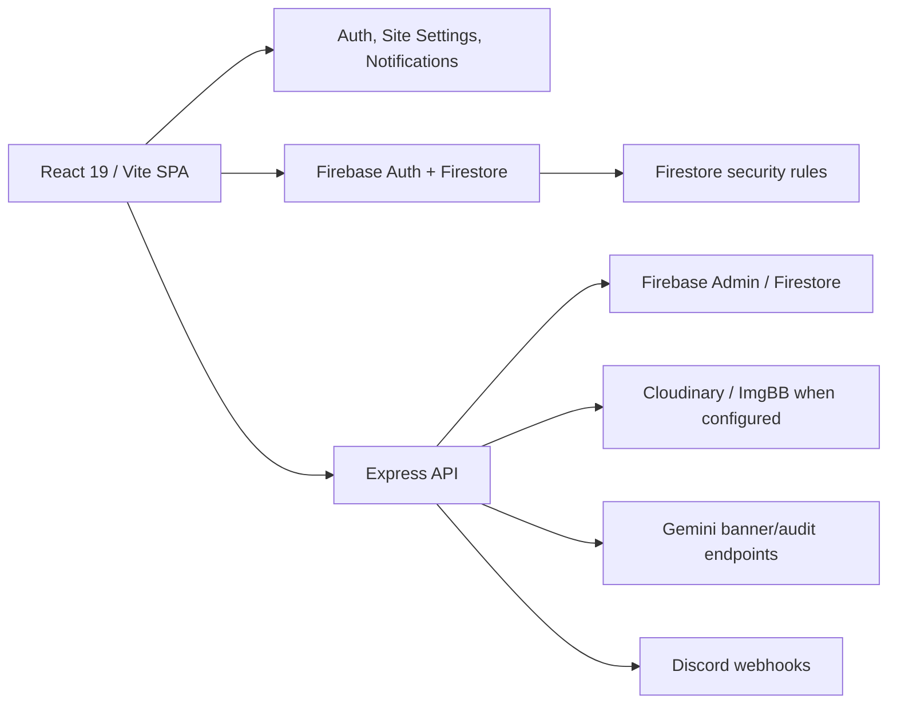

# NexPlay Product Requirements Document

**Document status:** implementation-aware baseline
**Source of truth:** repository audit completed 2026-08-14
**Scope:** current React/Vite client, Express server, Firebase/Firestore configuration, and checked-in documentation. This document preserves the existing information architecture and visual language. It does not authorize a redesign.

## 1. Executive summary

NexPlay is a Nepal-oriented esports competition platform. It lets players discover games, tournaments, scrims, organizations, teams, results, leaderboards, and news; it lets organizers run competitions; and it gives administrators operational, payment, content, and platform controls.

The product is a React 19 single-page application using Firebase Authentication and Firestore, with an Express server for privileged operations such as wallet changes, prize distribution, media processing, Discord delivery, AI banner generation, and SEO sitemap generation. Most product data is held in Firestore and much of the UI updates through direct client reads or listeners.

The core product model already exists and must remain recognizable:

- Public discovery: Home, Games, Tournaments, Scrims, Results, Organizations, Teams, Leaderboard, News, and legal/help pages.
- Player account: authentication, required in-game profile completion, dashboard, profile, wallet, notifications, team membership, tournament registration, and social following.
- Organizer operations: tournament creation, per-tournament administration, scrim operations, rooms, rosters, earnings, and stream/contact settings.
- Administrative operations: users, financial approvals, organizers, tournaments, games, payment methods, promotions, media, news, platform settings, and Discord announcements.

### Product preservation rule

Existing routes, tab structure, dark high-contrast visual system, card/grid patterns, mobile navigation, and Firebase-first data flow **must be preserved** unless a later, explicitly approved requirement changes them.

## 2. Product vision, goals, and non-goals

### Vision

Provide a practical online operating surface for esports competitions: discover an event, register and pay safely, compete with clear standings, receive results and prizes, and allow organizers and administrators to operate the ecosystem.

### Goals

1. Make public esports discovery fast on desktop and mobile.
2. Support player identity, in-game identity, teams, registration, and competition visibility.
3. Give organizers the tools to create, configure, schedule, group, score, announce, and settle tournaments and scrims.
4. Preserve auditable wallet and prize workflows by performing value-changing operations server-side.
5. Provide administrators with operational controls over users, payments, content, games, organizers, and settings.

### Non-goals / unknowns

- A subscription entitlement workflow is **UNKNOWN / REQUIRES PRODUCT CONFIRMATION**. Plans are modeled and administered, but an enforcement or payment workflow is not established by this audit.
- Real payment-gateway verification is **UNKNOWN**. The current product supports proof-based deposits and administrator approval rather than a verified gateway integration.
- Anti-cheat, identity/KYC, moderation service levels, support SLAs, and jurisdictional financial compliance are **UNKNOWN / REQUIRES PRODUCT CONFIRMATION**.
- An OBS/live overlay is not a current feature; checked-in project history says it was removed.

## 3. Users and permissions

| User | Verified current capability | Primary value |
|---|---|---|
| Anonymous visitor | Browse public content and public profiles; search/filter public catalogues | Discover events, games, teams, organizations, and results |
| Player (`player`) | Authenticate, complete profile, manage profile/wallet/team, register and leave tournaments, follow, submit disputes | Participate in competitions |
| Organizer (`organizer`) | Create and manage owned events; access organizer panel and owned tournament administration; issue Discord announcements | Operate competitions |
| Administrator (`admin`) | Full admin panel; financial and content management; roles, games, settings, media, organizers, news, promotions | Platform operations and oversight |

Role routing is enforced in `ProtectedRoute`; Firestore rules and server handlers supply the data-layer boundary. The client-side role check is not independently sufficient for sensitive actions.

## 4. Current architecture

### Client structure

- `src/App.tsx` owns routes, global providers, lazy loading, maintenance gate, notice banner, navbar, breadcrumbs, footer, error boundary, and profile-completion guard.
- `src/features/*` groups product areas by domain.
- `src/shared/*` contains Firebase config, types, contexts, services, hooks, constants, and reusable components.
- Styling is Tailwind CSS v4 with a small global CSS layer.

### Server structure

- `server.ts` mounts routes and serves Vite in development or SPA assets in production.
- Route modules cover authentication, tournaments/scrims, wallet, media, AI, Discord, and an admin scrim audit/fix utility.
- `server/shared.ts` supplies Firebase Admin access, token verification, and rate limiting.

### State and data behavior

- Authentication context listens to Firebase Auth, obtains/creates the private `users` profile, and creates `users_public` for first-time profiles.
- Site settings and notifications are provider-managed.
- Tournament detail and tournament-admin experiences use Firestore snapshots; many catalogue views fetch once and filter/sort in the browser.
- No general client state store is verified in use despite `zustand` being a dependency.

## 5. Information architecture and routes

| Route | Access | Page / purpose | Main dependencies and states |
|---|---|---|---|
| `/` | Public | Home; promotions, featured games/tournaments and marketing entry points | `slides`, `games`, `tournaments`; loading/error/empty patterns in component code |
| `/games` | Public | Game catalogue with text and mode filters | Published `games`; spinner and no-results state |
| `/games/:id` | Public | Game-mode browser | Game catalogue/tournament navigation |
| `/tournaments` | Public | Tournament catalogue with status, game, text filtering and cards | `tournaments`, published `games`; loading/error/empty |
| `/tournaments/:id` | Public | Tournament detail, registration, event information, standings and results | live tournament/participant listeners; join status; absent/not-found/error states |
| `/details/:id` | Public | Legacy redirect | Redirects to `/tournaments/:id` |
| `/scrims` | Public | Scrim catalogue | `GET /api/scrims`; loading/error/empty |
| `/results` | Public | Completed tournament results and featured winner surface | completed `tournaments`; manual-result fallback |
| `/leaderboard` | Public | Player and team rankings | `users_public`, `teams`; loading/error |
| `/organizations` | Public | Organizer directory and follow controls | `users_public`, `follows`; skeleton/empty/action feedback |
| `/organization/:id` | Public | Legacy redirect | Redirects to `/user/:id` |
| `/news` | Public | Organization/news post listing | `org_posts` |
| `/post/:id` | Public | News post detail | `org_posts` |
| `/teams` | Public; creation needs player | Team directory and create-team modal | `teams`, `team_members`, `users`, `users_public` |
| `/team/:id` | Public; management is membership-based | Team profile, roster, invitations, activity and management actions | `teams`, `team_members`, `team_invites`, `team_activity`, `users_public` |
| `/user/:id` | Public | Public player/organizer profile, history and follow action | `users_public`, teams, history, follows, posts |
| `/profile/:id` | Public | Legacy redirect | Redirects to `/user/:id` |
| `/about`, `/contact`, `/privacy`, `/terms` | Public | Static product/legal/support pages | No runtime data dependency verified |
| `/login`, `/register` | Public | Firebase authentication entry | Firebase Auth; reCAPTCHA may be configured |
| `/complete-profile` | Authenticated | Required in-game identity completion | `users`, `users_public` |
| `/dashboard` | Authenticated | Joined/hosted tournament dashboard and result actions | `participants`, `tournaments`, `team_members`, `teams`, `settings` |
| `/profile` | Authenticated | Personal settings, activity, organizer application, profile media | `users`, `users_public`, `transactions`, `follows`, `orgApplications` |
| `/wallet` | Authenticated | Balance, deposits, withdrawals, promotions, transaction history, disputes | `transactions`, `disputes`, wallet API |
| `/admin` | Admin | Multi-tab platform administration | Admin collections, user/tournament/wallet data |
| `/organizer` | Organizer/admin | Organizer console; tabs are query-string based | Owned tournaments, participants, earnings and org profile data |
| `/tournament-admin/:id` | Organizer/admin | Per-tournament administration | tournament and participant snapshots; groups, matches, bracket and results UI |
| `/organizer/scrim/:id` | Organizer/admin | Scrim detail/operation page | Tournament/scrim data |
| `*` | Public | Not-found view | N/A |

## 6. Global UX and design requirements

### Existing design system

- Dark slate base (`#0b1120`, `--color-dark #0f172a`) with dark cards/surfaces.
- Violet brand accent (`--color-brand-500 #8b5cf6`) and status colors (green, red, yellow, blue).
- Dense, uppercase, bold headings with system sans-serif body copy; high-contrast cards, rounded 2xl/3xl panels, borders, shadows, and restrained motion.
- Lucide icons, responsive grids, rounded pill navigation and filters, cards, modals, toast feedback, skeletons/spinners, and table-to-card behavior below 640px.
- Global focus-visible ring exists for links/buttons and focus treatment for inputs/selects/textareas.
- Layout has sticky navbar, breadcrumb/back behavior on non-home routes, fixed-width content containers, footer, overflow protection, and safe-area utility classes.

### Navigation requirements

- Desktop primary navigation remains Home, Games, and Organizations; secondary product links are retained in the mobile menu.
- Authenticated navbar retains notification, wallet, and profile affordances.
- Routes other than home retain the existing back affordance and breadcrumbs.
- The layout must preserve responsive collapse: desktop navigation at `lg`, mobile menu below it, and no horizontal page overflow.

### UX requirements

- Existing loading and empty messaging must be retained or added wherever a view currently can fail silently.
- Buttons must prevent duplicate value-changing submissions while requests are in flight.
- Forms must retain visible validation and toast/modal feedback patterns.
- New UI must use existing colour, radius, spacing, typography, card, modal, and action patterns unless explicitly approved otherwise.

## 7. Major user flows

### 7.1 Authentication and profile completion

1. Visitor opens Login/Register.
2. Firebase Auth establishes a session; `AuthContext` reads `users/{uid}`.
3. If absent, the client creates a baseline private and public profile.
4. Global profile guard redirects an authenticated profile missing `inGameId` or `inGameName` to `/complete-profile`.
5. Complete-profile updates required identity and returns the user to normal navigation.

**Failure behavior:** Authentication/data-load waits have 8-second and profile-related 5-second escape hatches. This prevents indefinite spinners but can render users as signed out or allow an incomplete profile to continue after timeout; see known issues.

### 7.2 Discover and register for a tournament

1. User discovers a tournament from Home, Games, Tournaments, Scrims, Dashboard, or a direct URL.
2. Tournament detail subscribes to the tournament and its participants; it exposes overview, description, players, roadmap, groups, and conditional completed results/kill rewards.
3. Authenticated user opens registration, supplies permitted teammate data, and submits.
4. Client calls `POST /api/wallet/join-tournament` with a Firebase ID token.
5. Server atomically validates tournament/user/duplicate/capacity/balance, creates deterministic participant record, increments participant count, deducts entry fee, writes a ledger entry when applicable, and grants XP.
6. UI displays success or returned failure; live participant and join-status listeners update state.

### 7.3 Leave tournament

1. Registered user chooses leave from tournament detail.
2. Client calls `POST /api/wallet/leave-tournament`.
3. Server atomically validates registration and event status, deletes the participant, decrements count, refunds the entry fee, and writes a refund transaction.
4. UI displays feedback and listener-based state updates.

### 7.4 Wallet deposit, withdrawal, promotion, and dispute

1. User opens Wallet and chooses deposit or withdrawal.
2. Deposit collects amount, payment method, sender number, transaction code, proof URL; server creates a pending transaction after validation and duplicate detection.
3. Withdrawal collects amount/method/account details; server validates, prevents recent duplicate pending requests, atomically locks/debits the balance, and writes a pending transaction.
4. Admin approves/rejects/reverses as provided by administration controls; approvals must update balance/ledger atomically.
5. Promo redemption calls the server, which validates availability and deterministic per-user redemption in a transaction.
6. A user can submit a Firestore `disputes` document for a selected transaction.

### 7.5 Team lifecycle

1. Authenticated player creates a team in Teams.
2. Client creates `teams` and `team_members`, then updates private/public profile team fields.
3. Team detail fetches team, members, public profiles, pending invites, and activity.
4. Team owner/invitee actions create/resolve invites; member management updates membership and profile team fields; delete attempts dependent cleanup.

### 7.6 Organizer competition operations

1. Approved organizer uses Organizer Panel, whose tabs are Overview, Tournaments, Scrims Hub, Match Rooms, Teams & Rosters, Wallet & Payouts, and Settings & Stream.
2. Organizer opens tournament creation/editing, selects published game, event/match properties, prize distribution, registration type, scoring configuration, and optional AI-generated banner.
3. Organizer opens the per-tournament panel: Overview, Groups & Teams, Match Schedule, Brackets, Settings, Registrations.
4. The panel creates/assigns groups, stores group credentials separately, schedules/updates matches, generates bracket/group matches, manages registrations/check-in, uploads results, advances stages, and sends Discord announcements.
5. Prize distribution uses `POST /api/wallet/distribute-prizes`, which is expected to validate owner/admin authorization and persist results/ledger/earnings atomically.

### 7.7 Administrative operations

Administrators access a responsive sidebar containing Dashboard; user management; pending deposits/withdrawals/history; organizer approvals/tournaments/organizations/earnings; tournaments/users/games/payments/promo/media/news; Discord; and settings. Administration owns manual approval workflows, content catalogues, roles, site notice/maintenance settings, and policy-sensitive actions.

## 8. Functional requirements

| ID | Feature | Requirement | Status | Priority | Dependencies / acceptance criteria |
|---|---|---|---|---|---|
| FR-001 | Routing | Preserve all routes in Section 5, legacy redirects, lazy loading, global error boundary, and not-found behavior. | EXISTING | P0 | `App.tsx`; route resolves to the documented view or redirect. |
| FR-002 | Authentication | Authenticate with Firebase and load a private `users` profile; create baseline private/public profiles when none exists. | EXISTING | P0 | AuthContext/Firebase; an authenticated first-time user has both profile documents or receives an explicit recoverable error. |
| FR-003 | Profile completion | Require in-game ID and in-game name before normal authenticated progression. | PARTIALLY IMPLEMENTED | P1 | Guard/CompleteProfile; timeout must not silently bypass an enforceable requirement. |
| FR-004 | Public discovery | Display Games, Tournaments, Scrims, Results, Teams, Organizations, Leaderboard, and News with visible loading, empty, and failure behavior. | PARTIALLY IMPLEMENTED | P1 | Firestore/API data; each catalogue handles failed query and zero results. |
| FR-005 | Tournament catalogue | Filter searchable public tournaments by current tabs/status/game while preserving current card and filter UI. | EXISTING | P1 | `tournaments`, `games`; filter result/count is accurate. |
| FR-006 | Tournament detail | Display event details, live participant count/status, description, players, roadmap, groups, credentials for authorized participants, and conditional results/rewards. | EXISTING | P0 | tournament/participant listeners and credentials helper; unauthorized users never see room credentials. |
| FR-007 | Registration | Create a player registration and collect entry fee atomically; prevent duplicate, over-capacity, closed-event, and insufficient-balance registration. | EXISTING | P0 | wallet API/Admin SDK; one successful submit creates one participant and at most one fee ledger record. |
| FR-008 | Registration approval/check-in | Support automatic/manual registration status plus organizer/admin approval and check-in. | EXISTING | P1 | participants rules/UI; only permitted fields may be changed by permitted roles. |
| FR-009 | Leaving event | Refund eligible participant entry fee and remove registration atomically. | EXISTING | P1 | wallet API; cannot leave completed/cancelled event; result updates balance/count/ledger together. |
| FR-010 | Tournament creation | Let organizers/admins create/edit owned events using published games, existing creation modal, reward/scoring fields, and existing visual hierarchy. | EXISTING | P0 | Firestore rules; creation must reject unauthorized/invalid payloads server or rules-side. |
| FR-011 | Tournament operations | Retain existing group, schedule, bracket, result, stage, room credential, qualification, and Discord control surfaces. | EXISTING | P0 | tournament administration hooks/services; every mutation has role/ownership authorization. |
| FR-012 | Results and scoring | Support manual/file/leaderboard result interfaces, point scoring, tournament results and per-kill reward views where configured. | EXISTING | P1 | scoring engines, results fields; completed results show winner/manual fallback accurately. |
| FR-013 | Wallet | Provide wallet balance, transaction history, deposit, withdrawal, promo redemption, and dispute creation. | EXISTING | P0 | wallet API, `transactions`, `disputes`; financial writes are server-mediated except documented admin actions. |
| FR-014 | Payment approvals | Allow administrators to approve/reject pending deposits/withdrawals and keep user balance plus ledger consistent. | EXISTING | P0 | admin hooks/Firestore; requires atomic/idempotent verification in implementation. |
| FR-015 | Prize settlement | Distribute prizes exactly once to valid winners, write results/transactions/earnings, and protect against replay/double settlement. | EXISTING | P0 | wallet endpoint/Admin SDK; settlement must be atomic or idempotent. |
| FR-016 | Teams | Support team creation, roster visibility, invites, acceptance/decline, member removal/leave, activity, and deletion under existing ownership patterns. | EXISTING | P1 | team collections; profile/team state remains consistent. |
| FR-017 | Profiles and follows | Support public profile display and authenticated follow/unfollow with notifications. | EXISTING | P2 | `users_public`, `follows`, notifications; follows must remain unique per follower/target. |
| FR-018 | Organizer onboarding | Allow verified users to submit organizer applications and admins to approve/reject/manage organizers. | EXISTING | P1 | `orgApplications`, users/public users; role updates propagate to access checks. |
| FR-019 | Notifications | Show authenticated user notifications and allow own read state changes. | EXISTING | P2 | Notification context/service; inaccessible notification queries produce a user-visible fallback. |
| FR-020 | Content/admin | Retain administration for games, slides, payment methods/categories, promotions, media, news, site settings, user roles, and organizer records. | EXISTING | P1 | admin role plus collection rules. |
| FR-021 | Media | Upload/process/delete media through authenticated server endpoints and catalog assets. | EXISTING | P1 | Cloudinary/ImgBB configuration; validate ownership and file constraints. |
| FR-022 | AI banner/audit | Keep organizer/admin AI banner generation and audit tools only when Gemini is configured and request authorization is present. | EXISTING | P3 | `GEMINI_API_KEY`; errors must disclose configuration failure safely. |
| FR-023 | Discord | Send configured organizer/admin tournament/scrim announcements without exposing webhook URLs to the browser. | EXISTING | P2 | Discord environment variables; unsuccessful delivery is surfaced. |
| FR-024 | Admin scrim utility | Restrict scrim audit/fix endpoints to administrators before operational use. | IMPLEMENTED | P0 | Firebase token, administrator authorization, and rate-limit checks reject unauthorized callers. |
| FR-025 | Pagination | Use bounded/paginated queries for large catalogues, administration lists, leaderboard, notifications and client-loaded data. | PARTIALLY IMPLEMENTED | P1 | Wallet API has pagination; many client catalogue queries remain unbounded. |

## 9. Data requirements

The fields below are implementation evidence, not a proposed replacement schema. `Timestamp | any` fields in client types indicate historical schema flexibility that should be normalized only through a planned migration.

| Entity / collection | Purpose and important fields | Operations / ownership |
|---|---|---|
| `users` | Private profile: UID, email, username, role, balance, earnings, in-game/team/contact/profile state, organizer and subscription fields | User reads/updates permitted profile fields; privileged balance/role changes are server/admin controlled |
| `users_public` | Public profile projection: username, role, public game/team/stat/profile data | Used by public profiles, organization browser, leaderboard; projection synchronization is a data-integrity dependency |
| `tournaments` | Event configuration, status, capacity/count, game, schedule, fee/prizes, format/stage, groups, bracket matches, results/rewards/scoring/audit | Public read; organizer owner/admin write under rules; nested credentials are separate |
| `tournaments/{id}/credentials/{main|group_*}` | Room ID/password separate from public tournament document | Read only host/admin/participant by known ID; no collection listing |
| `participants` | Deterministic registration record, player/team identity, status, payment/check-in/progression | Server creates during join; player may leave/check in; host/admin manages allowed fields |
| `transactions` | Immutable-style financial ledger: user, amount, type/status, references, balances, evidence/account details | Server creates player money movements; admin actions must be auditable and idempotent |
| `results` | Result/settlement record for tournament outcomes | Organizer owner/admin writes; public reads |
| `tournamentEarnings` | Organizer revenue split/release state | Admin writes; owner/admin reads |
| `games`, `slides` | Public game catalogue and homepage promotion content | Admin-managed/public-readable |
| `paymentMethods`, `paymentCategories`, `promocodes`, `subscriptionPlans` | Configurable wallet/promotion/subscription data | Admin-owned; promo get requires verified user; subscription enforcement unknown |
| `teams`, `team_members`, `team_invites`, `team_activity` | Team identity, membership, invitations and audit-like activity | Owner/member/admin behavior enforced by rules, with some multi-document client operations |
| `follows` | Social follower → target relationship | Authenticated verified user creates/deletes own relationship |
| `orgApplications`, `org_posts` | Organizer onboarding and public organization news | Applicants/admins access applications; organizers/admins own posts |
| `notifications`, `disputes`, `match_history` | Player communication, financial disputes, public performance history | Ownership/admin rules as defined in Firestore rules |
| `media`, `activityLogs`, `discordLogs`, `audit_reports` | Asset registry and operational logs/reports | Role-specific access; server logs Discord sends |
| `settings/site` | Notice, maintenance, organizer form and support/min-withdrawal settings | Site-wide dependency; admin writes |

### Data integrity requirements

1. Financial operations must be server-authorized, atomic where balance changes, idempotent, and ledger-backed.
2. Participant ID format (`{tournamentId}_{uid}`) is part of the join/credentials model and must not be changed without migration.
3. Public/private user projections must be updated together or reconciled reliably.
4. Tournament capacity, registrations, fees, refunds, prizes, and status must not be mutated by untrusted client calculations.
5. Existing Firestore indexes in `firestore.indexes.json` are deployment dependencies for documented composite queries.

## 10. API and integration requirements

### Verified API groups

| Group | Endpoints | Requirement |
|---|---|---|
| Auth | `/api/register`, `/api/login`, `/api/forgot-password`, `/api/reset-password`, `/api/me`, `/api/admin/set-claims` | Rate limit public auth endpoints; require token/admin authorization where applicable. Client implementation primarily uses Firebase Auth. |
| Wallet | deposit, withdraw, transactions, join/leave tournament, redeem promo, distribute prizes, migrate room credentials | Authenticate privileged calls; validate inputs; enforce duplicate prevention and atomic behavior. Migration endpoint needs explicit admin authorization review. |
| Tournament | generate groups, upload results, advance, delete, list scrims | Authenticate event mutations; validate organizer ownership/admin role; public scrim list handles errors. |
| Media | upload/process/delete/list | Authenticate, size/type validate, authorize deletion and avoid disclosing provider credentials. |
| AI | generate banner, audit, audit discussion | Organizer/admin-only with rate limiting; Gemini key remains server-only. Audit URL fetch needs SSRF controls. |
| Discord | announce | Organizer/admin-only, rate-limited, selected server-held webhook only. |
| SEO | `/sitemap.xml`, `/api/indexnow` | Sitemap failure returns error; IndexNow must validate its expected request/auth contract. |
| Admin scrim audit | audit/fix scrims | **Current defect:** endpoints are unprotected; add authentication + admin check before use. |

### External configuration

`GEMINI_API_KEY`, Cloudinary credentials, ImgBB key, Discord webhook URLs, and optional `VITE_RECAPTCHA_SITE_KEY` are declared in `.env.example`. Firebase project/client configuration is a deployment prerequisite. No secret may be committed to source or exposed in browser bundles.

## 11. Validation, error, loading, and empty-state requirements

- Keep per-page spinners/skeletons and route-level lazy-load fallback.
- Preserve the global error boundary; add contextual recovery where an operation can be retried safely.
- Validate tournament and wallet inputs server-side, including types, lengths, amount bounds, URL protocol, actor ownership, and current record state.
- Registration failures must distinguish duplicate, full, closed, insufficient balance, unauthenticated, authorization, and unexpected failure where the server provides that knowledge.
- Empty catalogue/filter states must explain whether there are no records or no matches and offer a clear filter reset where existing patterns do.
- Do not swallow console-only errors for user actions. User-facing actions require toast/banner/modal feedback and an actionable retry or next step.
- Network timeout/offline conditions should retain unsaved form values and avoid claiming success before server/Firestore confirmation.

## 12. Non-functional requirements

| Area | Requirement |
|---|---|
| Performance | Retain route-level lazy loading, image lazy-loading where present, responsive image processing, and bounded queries. Add pagination before collections can grow materially. |
| Reliability | Preserve Firestore snapshot error handlers and authenticated server error responses; value-changing requests must be retry-safe/idempotent. |
| Security | Firebase token verification and Firestore rules are mandatory. Sensitive operations cannot rely on UI role gates. Protect unguarded admin endpoints, ownership checks, SSRF-prone URL fetching, and room credentials. |
| Accessibility | Maintain semantic labels, focus-visible rings, keyboard-usable modals/dropdowns, visible focus, sufficient contrast, alt text, and `aria-expanded`/navigation labels. Test dynamic tab/modal focus behavior. |
| Responsive behavior | Support phone through large desktop; preserve 44px touch targets, `sm/md/lg/xl` layouts, mobile menu, responsive tables, safe areas, and long-text overflow protection. |
| Maintainability | Keep domain features in existing folders; reuse contexts/services/types/components; avoid direct duplicated financial or scoring logic. |
| Scalability | Avoid unbounded client `getDocs` on large collections, avoid N+1 profile lookups, rely on declared indexes, and monitor Firestore read cost from live listeners. |
| Browser support | Current implementation targets modern browsers capable of Firebase, ES modules, `AbortSignal.timeout`, and current React/Vite output. Exact supported-browser matrix is UNKNOWN. |

## 13. Security requirements and identified risks

1. **P0 — Unprotected admin scrim endpoints:** `GET /api/admin/audit-scrims` exposes tournament inventory, and `POST /api/admin/fix-scrims` can mutate tournament data without authentication. Require `authenticateToken`, an admin role check, input validation, audit logging, and rate limiting.
2. **P0 — Server-side financial authority:** Retain server/Admin SDK authority for player deposits, withdrawals, registration charges/refunds, promo redemption, and prize distribution. Test idempotency and administrative balance adjustments.
3. **P1 — URL-fetch SSRF:** `/api/audit` lets privileged callers supply a URL which the server fetches. Restrict protocol, resolve/reject private and link-local network addresses, cap redirects/response size, and keep timeout enforcement.
4. **P1 — Access control parity:** Check every API mutation for both authentication and ownership/role authorization. In particular, review room-credential migration and tournament operations.
5. **P1 — Client multi-document writes:** Team/profile/public-profile mutations can partially fail. Use a batch/transaction or repair/reconciliation strategy when consistency is required.
6. **P1 — Private data:** Keep room passwords only in credential subdocuments; do not add them back to public tournament reads.
7. **P2 — Validation consistency:** Ensure client helper validation is mirrored on the server or Firestore rules; frontend validation alone is not a boundary.

## 14. Edge cases

| Area | Required handling |
|---|---|
| Authentication | Firebase unavailable, profile document missing, unverified/blocked/banned user, completion timeout, expired token, role changed mid-session |
| Tournament | Missing/deleted event, full capacity race, duplicate submit, closed/cancelled/completed event, manual registration pending/rejected, zero fee, team/solo mismatch, missing host/game/banner/time |
| Rooms/results | User is not a participant, unknown group, unset room credentials, duplicate result upload, incomplete match data, tie/qualification boundary, scoring snapshot mismatch |
| Wallet | Invalid/negative/too-large amount, duplicate payment code, concurrent withdrawals/joins, balance changed after modal opened, admin rejects a locked withdrawal, duplicate promo redemption, partial prize settlement |
| Teams/social | Invitee absent, duplicate follow/invite, stale member record, owner leaves/deletes, partial profile projection update, more than Firestore `in` query limit |
| Catalogues | Zero records, failed query, slow listener, long names/IDs, large datasets, filters with no match, unavailable image |
| UI/device | 320px-like viewport, safe areas, keyboard navigation, browser resize, reduced connectivity, rapid clicks, modal close during request, screen-reader tab labels |

## 15. Acceptance criteria for major features

1. **Authentication:** Given a valid Firebase user with no profile, when auth initialization completes, then a private `users/{uid}` and public `users_public/{uid}` profile are created or a visible recoverable error is shown.
2. **Profile completion:** Given an authenticated profile lacking in-game ID or name, when it visits a normal route, then it is redirected to `/complete-profile` until the required fields are saved; an infrastructure timeout must be explicitly handled, not silently treated as completion.
3. **Tournament registration:** Given an authenticated eligible player and an open event with available capacity and balance, when registration succeeds, then exactly one participant record is created, capacity increases once, balance changes by the entry fee once, and one matching ledger entry exists when fee is nonzero.
4. **Registration rejection:** Given a duplicate/full/closed/insufficient-funds registration, when submitted, then no participant/capacity/balance/ledger mutation occurs and the user receives the relevant failure message.
5. **Leave/refund:** Given a registered player leaves a non-finalized event, when the request succeeds, then registration is removed, capacity decreases once, balance is refunded once, and a refund ledger record exists when fee is nonzero.
6. **Room credentials:** Given a nonparticipant public visitor, when opening tournament details, then no room ID or password is returned. Given an eligible participant, when the credential exists, then only that participant/host/admin can retrieve the known credential document.
7. **Wallet deposit:** Given valid proof-based deposit input, when submitted, then exactly one pending transaction is created and balance remains unchanged until approval.
8. **Withdrawal:** Given sufficient balance and valid input, when submitted, then the debit and pending withdrawal record commit atomically; duplicate rapid submissions cannot lock funds twice.
9. **Promo:** Given a valid active unredeemed promo below its limit, when redeemed, then balance and use count change once and a deterministic ledger record prevents repeat redemption.
10. **Prize settlement:** Given valid authorized winners and an unsettled completed event, when settlement succeeds, then each valid winner is credited once and resulting transactions/results/earnings remain reconcilable; a repeat request does not pay again.
11. **Teams:** Given an authenticated verified user creates a team, when all writes succeed, then team, membership, and private/public profile team references agree. Failures must not leave misleading success feedback.
12. **Admin isolation:** Given an unauthenticated or non-admin caller, when it calls any `/api/admin/*` mutation or audit endpoint, then it receives 401/403 and no data/write is exposed/performed.
13. **Responsive discovery:** Given a small viewport, when a user navigates or filters a catalogue, then controls remain reachable, long text does not overflow, focus is visible, and tables use the existing mobile transformation where applicable.

## 16. Prioritized release plan

### Must fix (P0)

1. Protect `/api/admin/audit-scrims` and `/api/admin/fix-scrims`.
2. Verify end-to-end idempotency and authorization of financial administration and prize settlement.
3. Ensure room credentials never leak through public tournament payloads or logs.

### Should fix (P1)

1. Add bounded pagination/server querying to large catalogue/admin/profile data paths.
2. Replace silent read/action failures with consistent visible retryable states.
3. Remove profile-completion/auth timeout bypass ambiguity by providing a recoverable profile-load state.
4. Make multi-document team/profile projection writes atomic or reconcile them.
5. Harden AI audit URL fetching against SSRF.

### Nice to have (P2/P3)

1. Define and implement subscription-plan entitlement if it is a product goal.
2. Add explicit cross-browser and assistive-technology test matrix.
3. Establish automated end-to-end tests for player, organizer, wallet, and admin critical flows.
4. Add operations dashboards for listener/read cost, settlement reconciliation, and failed Discord/media/AI calls.

## 17. Known issues and implementation discrepancies

- The checked-in `AI/ROUTES.md` references routes/components that do not match current `App.tsx` (for example an overlay route); the route table in this PRD reflects `App.tsx`.
- `server/routes/admin-scrims.ts` is protected by Firebase token, administrator authorization, and rate limits.
- Multiple catalogue views issue unbounded client collection reads and may not scale with platform growth.
- Several UI data flows use direct Firestore write sequences across more than one document, which can leave partial state if an intermediate operation fails.
- `ProfileCompletionGuard` and `ProtectedRoute` intentionally time out profile loading. This avoids an infinite spinner but can weaken the intended mandatory-profile experience during an outage.
- A `zustand` dependency is present, but this audit did not verify a corresponding store in source.
- Existing internal architecture/database maps contain historical/inexact collection, route, or folder descriptions; source and rules must take precedence.
- The availability and completeness of production Firebase, Cloudinary/ImgBB, Gemini, Discord, payment method, and reCAPTCHA configuration cannot be verified from repository source.

## 18. Dependencies

- Firebase Authentication, Firestore, Firestore rules and composite indexes.
- Firebase Admin credentials/runtime for the Express server.
- Node/Express/Vite deployment environment; Firebase Hosting configuration and/or Vercel configuration are checked in.
- Cloudinary and/or ImgBB credentials for media; Gemini API key for AI tools; Discord webhook configuration for announcements.
- Existing domain engines: tournament, scoring, per-kill reward, room credential, notification, media, Discord, and SEO services.

## 19. Traceability matrix

| Requirement | Page(s) | Primary implementation | Data/API | Acceptance criteria |
|---|---|---|---|---|
| FR-002/003 | Login, Register, Complete Profile, all guarded routes | `AuthContext`, `ProfileCompletionGuard`, `ProtectedRoute` | Firebase Auth; `users`, `users_public` | AC 1–2 |
| FR-004/005 | Home, Games, Tournaments, Scrims, Results | feature views, `GameCard`, `TournamentCard` | `games`, `slides`, `tournaments`; `/api/scrims` | AC 13 |
| FR-006–009 | Tournament Details | `TournamentDetails`, `RegistrationModal`, `GroupStandingsView` | tournament/participant listeners; wallet join/leave; credentials | AC 3–6 |
| FR-010/011 | Organizer, Tournament Admin | `TournamentCreateModal`, `useOrgData`, `useTournamentAdmin`, admin tabs | `tournaments`, `participants`, credentials; tournament API | AC 6, 10 |
| FR-012 | Results, Tournament Details, Dashboard | result uploader/board/manual manager; scoring/per-kill services | `tournaments`, `results` | AC 10 |
| FR-013–015 | Wallet, Admin | `Wallet`, `WalletModal`, `useAdminData`, transaction components | wallet API; `transactions`, `disputes`, `tournamentEarnings` | AC 7–10 |
| FR-016 | Teams, Team Details | `Teams`, `TeamDetails` | team collections and profiles | AC 11 |
| FR-017/019 | Public Profile, Organizations, Navbar | profile/org views; notification service/dropdown | `follows`, `notifications`, `users_public` | action feedback and own-data access |
| FR-018 | Profile, Admin | Profile organizer application; admin organizer tabs | `orgApplications`, users | role/access reflects approval |
| FR-020 | Admin | `AdminPanel`, `useAdminData`, administration tabs | admin-managed collections/settings | only admins may mutate |
| FR-021–023 | tournament/admin/profile media tools | `ImageUploader`, media service, AI/Discord components | media/AI/Discord APIs | authenticated config-safe calls |
| FR-024 | No dedicated UI required | `server/routes/admin-scrims.ts` | `/api/admin/audit-scrims`, `/api/admin/fix-scrims` | AC 12 |
| FR-025 | Catalogues, wallet, admin | feature queries/API | Firestore indexes and wallet pagination | bounded list behavior under large data |

## 20. Verification record

This PRD was derived from `src/App.tsx`, feature views/components/hooks, shared contexts/services/types, `server.ts`, all server route modules, `firestore.rules`, `firestore.indexes.json`, environment example, and existing repository documentation. It intentionally labels items as unknown where production configuration or behavior is not evidenced by source.
